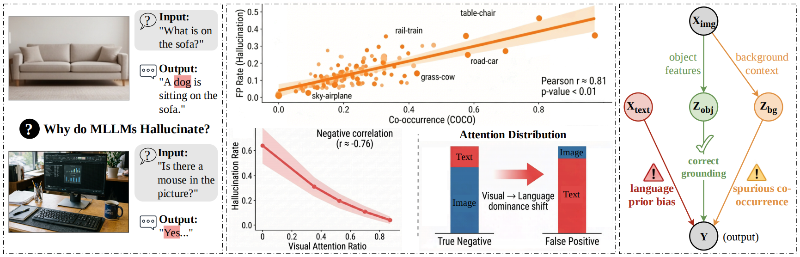
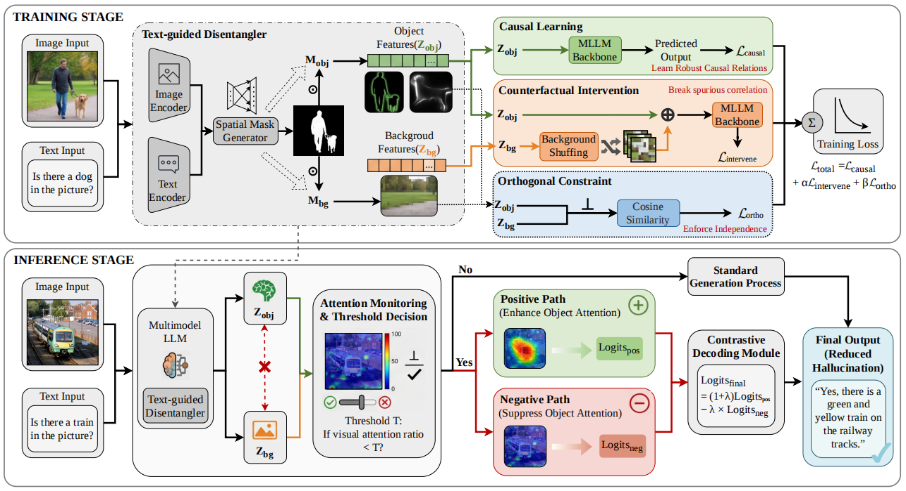
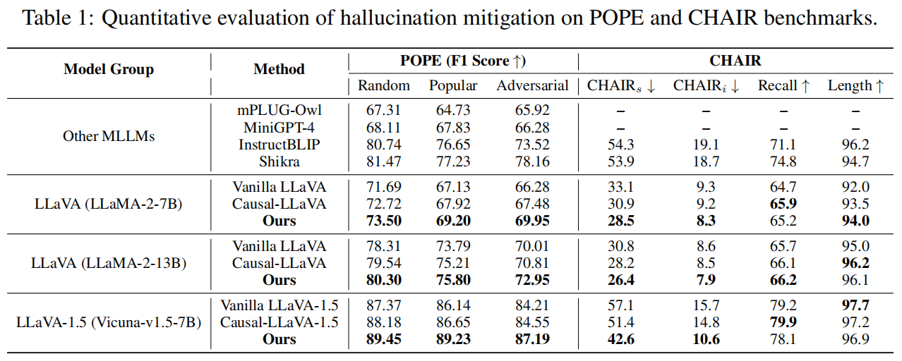

# 🌟 Disentangle to Mitigate: A Unified Causal Framework for Object Hallucinations in MLLMs
[](https://opensource.org/licenses/Apache-2.0)

> This is the official repository for the paper **"Disentangle to Mitigate: A Unified Causal Framework for Object Hallucinations in MLLMs"**.

---

## 📖 Abstract

Multimodal Large Language Models (MLLMs) frequently suffer from object hallucinations. We formulate this issue as a **causal misattribution** problem driven by *spurious visual co-occurrences* and *autoregressive language priors*. Since existing heuristic strategies lack a unified causal structure to disentangle these confounders, we propose **CLEAR** (**C**ausal **L**atent **E**xtraction **A**nd **R**e-normalization), a comprehensive training-inference causal intervention framework. 

- **During training**, CLEAR employs **Latent Causal Disentanglement (LCD)** to isolate target objects from background confounders via in-image counterfactual shuffling, effectively breaking spurious correlations.  
- **During inference**, it utilizes **Mask-Guided Contrastive Decoding (MGCD)** to explicitly suppress language priors by contrasting a target-enhanced factual path with a mask-inverted counterfactual path.  

Furthermore, by operating strictly within the normalized probability space (**Probability-Space Intervention, PSI**), our intervention avoids spatial distortion. Extensive experiments demonstrate that CLEAR achieves state-of-the-art hallucination mitigation (e.g., POPE, CHAIR) while perfectly preserving fine-grained cognitive capabilities on general benchmarks (e.g., MME, MMBench).

---

## 🎯 Causal Modeling of Object Hallucination Process

<p align="center">
  
</p>

We reveal that hallucinations are essentially **causal misattributions** triggered by two erroneous paths:

1. **Spurious Co-occurrence Bias ($Z_{bg} \rightarrow Y$)**  
2. **Language Prior Bias ($X_{text} \rightarrow Y$)**  

<p align="center">
  
</p>

---

## ⚙️ Installation & Environment Setup

### 1. Clone the Repository
```bash
git clone CLEAR.git
cd CLEAR
````

### 2. Set Up the Environment

```bash
conda create -n clear python=3.10 -y
conda activate clear
pip install --upgrade pip
pip install -e .
```

---

## 🧩 Pre-requisites

### 1. CLIP Model

Download the vision encoder:

* HuggingFace: `clip-vit-large-patch14-336`

### 2. Vicuna Base Model

Download the language backbone:

* HuggingFace: `lmsys/vicuna-7b-v1.5`

Place them into:

```bash
./checkpoints/
```

### 3. Evaluation Datasets

Please follow the official LLaVA evaluation instructions to download:

* POPE
* MSCOCO (for CHAIR)
* MME
* MMBench

Put them under:

```bash
./playground/data/eval/
```

---

## 🚀 Training (Latent Causal Disentanglement)

```bash
bash scripts/v1_5/finetune_lora.sh
```

> ⚠️ If using LLaMA-2 backbone, change:

```bash
--version vicuna_v1 → --version v1
```

---

## 🧪 Inference & Evaluation (MGCD + PSI)

### Evaluate on POPE

```bash
bash run_eval_pope.sh
```

### Evaluate on MME

```bash
bash run_eval_mme.sh
```

### Evaluate on CHAIR

```bash
bash run_eval_chair.sh
```

---

## 💡 Hyperparameters

Modify in:

```bash
llava/eval/model_vqa_loader.py
```

* `threshold (T)` → visual attention threshold (default: 0.20)
* `alpha (λ)` → contrastive strength (default: 0.4)
* `start_layer / end_layer` → intervention range (default: 8–28)

---

## 🏆 Main Results

<p align="center">
  
</p>

CLEAR consistently achieves:

* ✅ **Best hallucination suppression (POPE / CHAIR)**
* ✅ **No degradation in cognitive ability (MMBench / MME)**
* ✅ **Strong generalization across model scales**

---

## 🙏 Acknowledgement

This project builds upon:

* LLaVA: Large Language and Vision Assistant
* Qwen2-VL: Enhancing Vision-Language Model’s Perception of the World at Any Resolution
* VCD: Mitigating Object Hallucinations in Large Vision-Language Models through Visual Contrastive Decoding
* OPEAR: Alleviating Hallucination in Multi-Modal Large Language Models via Over-Trust Penalty and Retrospection-Allocation

We sincerely thank the open-source community for their contributions.

---
